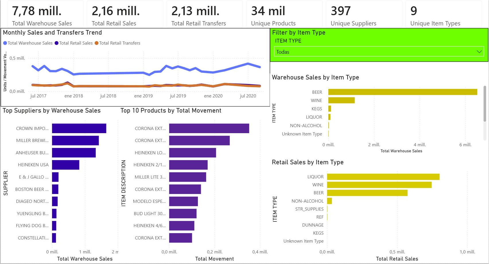
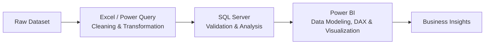

# Warehouse & Retail Sales Analysis

**End-to-End Data Analytics Project | Excel → Power Query → SQL Server → Power BI**

This project analyzes **307,645 warehouse and retail records** to identify patterns in product movement across channels, categories, suppliers, products, and reporting periods, while also highlighting operational anomalies that require business context.

## Project Overview

The analysis follows the data from raw CSV preparation through an interactive Power BI report. Excel and Power Query were used for cleaning and transformation, SQL Server for validation and analysis, and Power BI for data modeling, DAX measures, and visualization.

The source fields are labeled as sales and transfers, but the dataset does not contain price, cost, revenue, profit, or inventory-balance data. For that reason, the analysis treats these values as **recorded movement volume**, not monetary performance or on-hand inventory.

## Dataset Snapshot

| Metric | Value |
|---|---:|
| Records | **307,645** |
| Unique products | **34,056** |
| Suppliers | **397** |
| Item types | **9** |
| Reporting periods | **24** |
| Observed date range | June 2017–September 2020 |

## Dashboard

The interactive report is available in the [Power BI project file](<PowerBi/BI Warehouse.pbix>).



It includes:

- KPI cards for warehouse sales, retail sales, retail transfers, unique products, suppliers, and item types
- Monthly warehouse sales, retail sales, and retail transfers trend
- Warehouse and retail movement by item type
- Top suppliers by warehouse sales
- Top 10 products by total movement
- Interactive item-type filter

## Key Findings

- **Warehouse Sales is the largest movement channel**, totaling approximately **7.78 million recorded units/movements** across the available periods.
- **Beer leads warehouse movement** by a substantial margin within the dataset.
- **Retail activity is comparatively more balanced** across Liquor, Wine, and Beer than warehouse movement.
- **A relatively small group of Beer SKUs accounts for a meaningful share of recorded movement**; the Top 10 products shown in the report are Beer items.
- **Negative values were retained rather than removed.** They may represent returns, credits, corrections, or other operational adjustments, but their exact meaning cannot be confirmed without source-system rules or additional business context.

## Business Interpretation

The findings can support operational conversations in several areas without implying that the dataset contains actual inventory balances or financial measures.

| Use case | How this analysis can help |
|---|---|
| Inventory planning | Focus review on high-movement categories and SKUs when evaluating replenishment priorities. |
| Supplier coordination | Identify suppliers associated with the highest warehouse movement for planning and follow-up. |
| Warehouse capacity management | Compare movement by category and reporting period to support capacity and workload discussions. |
| Anomaly monitoring | Surface negative or unusual values for investigation against operational rules and source records. |
| Operational reporting | Provide a repeatable view of movement across channels, products, suppliers, categories, and time. |

These are potential decision-support applications. Additional inventory, service-level, lead-time, cost, and business-rule data would be needed for prescriptive recommendations.

## Analytics Workflow



## Data Cleaning

The [cleaned workbook](<Clean data/Cleaned data.xlsx>) contains the prepared dataset and a data dictionary. The transformation decisions are documented in the [Data Cleaning Log](<Documentation/Data Cleaning Log.xlsx>).

Key steps:

- Promoted headers and corrected data types
- Converted `ITEM CODE` to text to preserve identifier formatting
- Replaced 167 blank supplier values with `Unknown Supplier`
- Replaced one blank item type with `Unknown Item Type`
- Replaced three null `RETAIL SALES` values with `0`, as documented in the cleaning log
- Created a proper `DATE` field from `YEAR` and `MONTH`
- Retained all 307,645 rows and reported zero cleaning errors
- Preserved negative values for separate operational review

The cleaning log records **113 negative Retail Sales values**, **1,016 negative Retail Transfers values**, and **716 negative Warehouse Sales values**.

## SQL Validation & Analysis

After preparation, the data was loaded into SQL Server. The project documentation records a final validation count of **307,645 rows**.

The repository includes:

- [`SQLQuery1.sql`](SQL/SQLQuery1.sql) — creates the `WarehouseRetail` database
- [`SQLQuery2.sql`](SQL/SQLQuery2.sql) — aggregates retail sales, retail transfers, warehouse sales, and total movement to return the Top 10 products
- [`validation_queries.sql`](SQL/validation_queries.sql) — reproduces the principal row, date, cardinality, channel-total, and negative-value checks

The product-level query groups by item code, description, and type, then sorts results by combined movement.

## Power BI / DAX

The [Power BI report](<PowerBi/BI Warehouse.pbix>) contains one dashboard page with KPI cards, a monthly trend, four bar charts, and an item-type slicer.

The report uses measures including:

- Total Warehouse Sales
- Total Retail Sales
- Total Retail Transfers
- Total Movement
- Unique Products
- Unique Suppliers
- Unique Item Types

`Total Movement` is defined as:

```DAX
Total Movement =
SUM('Warehouse_and_Retail_Sales$'[RETAIL SALES]) +
SUM('Warehouse_and_Retail_Sales$'[RETAIL TRANSFERS]) +
SUM('Warehouse_and_Retail_Sales$'[WAREHOUSE SALES])
```

## Limitations

- The dataset does not include price, cost, revenue, profit, or inventory-balance data.
- Sales and transfer values are treated as movement-volume measures, not monetary values.
- The 24 reporting periods are not consecutive across the full June 2017–September 2020 date range.
- Promotions, demand drivers, service levels, lead times, seasonality controls, and external market events are not included.
- Negative values require business context to determine whether they represent returns, credits, corrections, or another type of operational adjustment.
- Findings describe the available data and should not be generalized beyond its scope without additional validation.

## Repository Structure

```text
warehouse-retail-sales-analysis/
├── README.md
├── Raw data/
│   └── Warehouse_and_Retail_Sales.csv
├── Clean data/
│   └── Cleaned data.xlsx
├── Documentation/
│   └── Data Cleaning Log.xlsx
├── SQL/
│   ├── SQLQuery1.sql
│   ├── SQLQuery2.sql
│   └── validation_queries.sql
├── PowerBi/
│   └── BI Warehouse.pbix
├── images/
│   └── dashboard-overview.png
└── Warehouse_Retail_Sales_README.pdf
```

| Artifact | Purpose |
|---|---|
| [Raw dataset](<Raw data/Warehouse_and_Retail_Sales.csv>) | Original warehouse and retail records |
| [Cleaned dataset](<Clean data/Cleaned data.xlsx>) | Power Query output with the added date field and data dictionary |
| [Data Cleaning Log](<Documentation/Data Cleaning Log.xlsx>) | Transformation decisions, row checks, and negative-value notes |
| [SQL scripts](SQL/) | Database setup, validation, and Top 10 product movement analysis |
| [Power BI report](<PowerBi/BI Warehouse.pbix>) | Interactive dashboard and DAX-based metrics |
| [Dashboard image](images/dashboard-overview.png) | Portfolio-ready preview captured from the Power BI report |
| [Project PDF](Warehouse_Retail_Sales_README.pdf) | Original long-form project documentation |

## Conclusion

This project demonstrates an end-to-end data analytics workflow, from raw data preparation and SQL validation to Power BI reporting and business insight generation.

The final report provides a concise view of warehouse and retail movement, category mix, supplier contribution, product concentration, temporal patterns, and values that merit operational follow-up.
